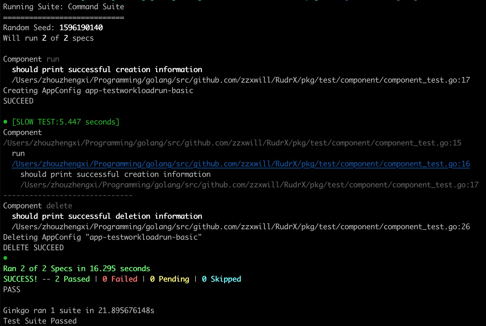

# Development

This doc explains how to set up a development environment, so you can get started
contributing to `RudrX` or build a PoC (Proof of Concept). 

## Prerequisites

1. Golang version 1.12+
2. Kubernetes version v1.15+ with `~/.kube/config` configured.
3. OAM Kubernetes Runtime installed.
4. Kustomize version 3.8+
5. ginkgo 1.14.0+ (just for [E2E test](https://github.com/cloud-native-application/RudrX/blob/master/DEVELOPMENT.md#e2e-test))

## Build
* Clone this project

```shell script
git clone git@github.com:cloud-native-application/RudrX.git
```

* Install Template CRD into your cluster

```shell script
make install
```

* Install template object 

```shell script
kubectl apply -f config/samples/
```

## Develop & Debug
If you change Template CRD, remember to rerun `make install`.

Use the following command to develop and debug.

```shell script
$ cd cmd/rudrx
$ go run main.go COMMAND [FLAG]
```

For example, use the following command to create and run an application.
```shell script
$ go run main.go run containerized app2057 nginx:1.9.4
Creating AppConfig app2057
SUCCEED

$ kubectl get oam
NAME                             WORKLOAD-KIND
component.core.oam.dev/app2057   ContainerizedWorkload

NAME                                     AGE
containerizedworkload.core.oam.dev/poc   53m

NAME                                            AGE
applicationconfiguration.core.oam.dev/app2057   69s

NAME                                                              DEFINITION-NAME
traitdefinition.core.oam.dev/simplerollouttraits.extend.oam.dev   simplerollouttraits.extend.oam.dev

NAME                                                                  DEFINITION-NAME
workloaddefinition.core.oam.dev/containerizedworkloads.core.oam.dev   containerizedworkloads.core.oam.dev
workloaddefinition.core.oam.dev/deployments.apps                      deployments.apps
workloaddefinition.core.oam.dev/statefulsets.apps                     statefulsets.apps
```

## E2E test
```
$ cd pkg/test
$ ginkgo -v -r
```



## Make a pull request
Remember to write unit-test and e2e test before making a pull request.
